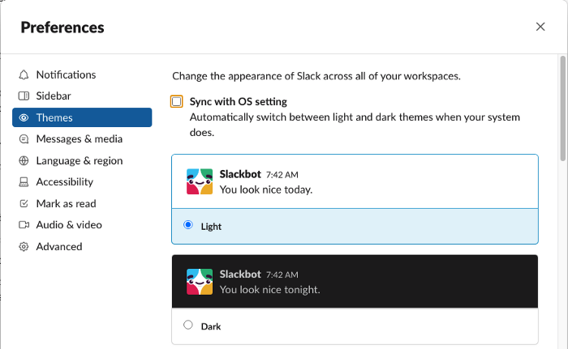
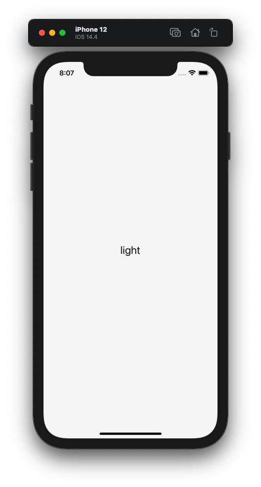
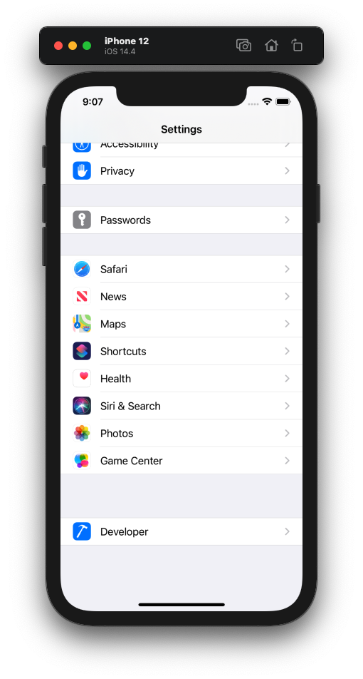

https://hstrada.medium.com/alterando-a-cor-do-tema-de-seu-aplicativo-em-react-native-conforme-a-configura%C3%A7%C3%A3o-padr%C3%A3o-do-celular-5faa6e647b37

# Alterando a cor do tema de seu aplicativo em React Native conforme a configuração padrão do celular

Em alguns aplicativos mobile ou desktop é usualmente comum você encontrar a opção para alterar o tema da sua aplicação (light e dark) ou sincronizá-lo com o tema escolhido no seu dispositivo.


<sub>Alterar o tema da aplicação do Discord</sub>




<sub>Alterar o tema do Slack baseado na escolha do sistema operacional.</sub>

Nessa postagem, iremos alterar as cores de um aplicativo React Native, baseadas no tema escolhido pelas preferências do usuário.

Nesse contexto apresentado, você pode utilizar o hook useColorScheme() para retornar o valor escolhido a partir da escolha do tema do dispositivo. Ele pode retornar três valores:

`light`, `dark` ou `null`

## Boilerplate — contextualização do projeto

Este projeto foi construído na versão 0.64.0 do React Native (a mais recente até a data da publicação) e também pode ser utilizado em outras versões. Opcionalmente você pode especificar a versão que desejar e optar pela utilização de TypeScript.

Vamos criar um projeto na versão mais recente do RN e utilizar o TypeScript. O nome do projeto será Colourse. Você pode encontrar toda a configuração de ambiente [aqui](https://reactnative.dev/docs/environment-setup).

```bash
npx react-native init Colourse --template react-native-template-typescript
```

### Ferramentas

Para a montagem do exemplo, eu estou utilizando o styled-components, mas você pode utilizar o que melhor se estruturar ao seu cenário. Para a instalação do styled-components e configuração no projeto, você pode encontrar o guia [aqui](https://styled-components.com/docs/basics#installation).

### Escolha do tema

Vamos criar dois temas para coincidir com as possíveis opções que o usuário poderá escolher seguindo as cores de seu dispositivo.

[Light Theme](https://github.com/hstrada/react-native-color-scheme/blob/master/Colourse/src/theme/light/index.ts)
```ts
const light: DefaultTheme = {
    colors: {
        background: '#F6F6F6',
        text: '#121212',
    }
};
```

[Dark Theme](https://github.com/hstrada/react-native-color-scheme/blob/master/Colourse/src/theme/dark/index.ts)
```ts
const dark: DefaultTheme = {
    colors: {
        background: '#121212',
        text: '#F6F6F6',
    }
};
```

### Estrutura do projeto

```
App.tsx
├── src
    ├─ theme
       ├── dark
       ├── light
```

A estrutura padrão do React Native foi mantida conforme a criação do projeto. Fora adicionado uma pasta src com as referências dos [temas](https://github.com/hstrada/react-native-color-scheme/tree/master/Colourse/src).


<sub>Estrutura do tema apresentada no projeto.</sub>

### Estrutura dos componentes

Para apresentar a estrutura criada e dar visibilidade as alterações que serão feitas pela escolha da configuração do dispositivo do usuário, um wrapper e uma label foram criados. Eles atendem respectivamente a view para o conteúdo da tela e o texto representado pelo tema.

https://github.com/hstrada/react-native-color-scheme/blob/master/Colourse/App.tsx#L8

```tsx
const Wrapper = styled.View`
  background-color: ${({theme}) => theme.colors.background};
  flex: 1;
  justify-content: center;
  align-items: center;
`;

const Label = styled.Text`
  color: ${({theme}) => theme.colors.text};
  font-size: 24px;
`;
```

Após a criação, a estrutura do App.tsx foi alterado para atender o nosso cenário proposto.

```tsx
return (
    <ThemeProvider theme={theme}>
        <Wrapper>
            <Label>{deviceColorScheme}</Label>
        </Wrapper>
    </ThemeProvider>
);
```

## Alterando o tema baseado na aparência

Como comentamos, com o hook mencionado, podemos ter a seleção das preferências do usuário. Baseado nessa preferência, podemos definir a cor de estilo para a nossa aplicação.

```tsx
const App = () => {
  const deviceColorScheme = useColorScheme();
  const theme = themes[deviceColorScheme || 'dark'];

  return (
    <ThemeProvider theme={theme}>
      <Wrapper>
        <Label>{deviceColorScheme}</Label>
      </Wrapper>
    </ThemeProvider>
  );
};
```

No meu simulador (iOS), a configuração inicial se mantém como light. Na primeira inicialização do projeto, você encontrará o tema light configurado conforme fizemos.



<sub>Apresentação do aplicativo com tema light.</sub>

Para realizar a alteração da configuração do simulador iOS, você encontrará a configuração e poderá realizar a alteração em:

```
Settings > Developer > Appearance > Dark Appearance
```



<sub>Ajustes do simulador iOS.</sub>


<sub>Alterando as preferências do usuário.</sub>

Reabra o aplicativo para visualizar as modificações feitas.


<sub>Apresentação do aplicativo com tema dark.</sub>

## Código da aplicação

Você pode encontrar o código completo da aplicação no [GitHub](https://github.com/hstrada/react-native-color-scheme).
